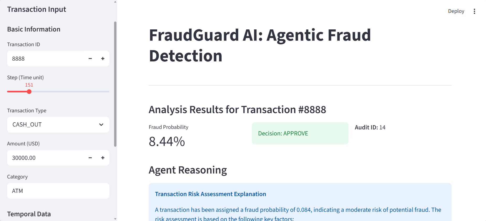
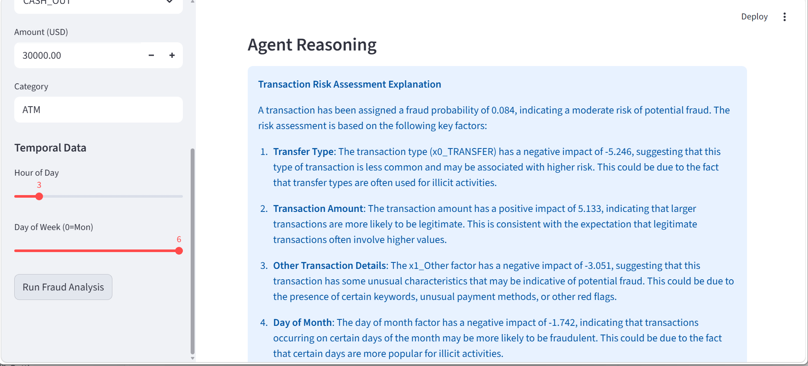
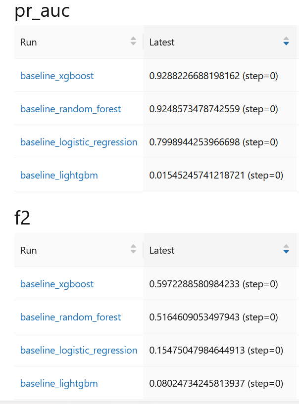
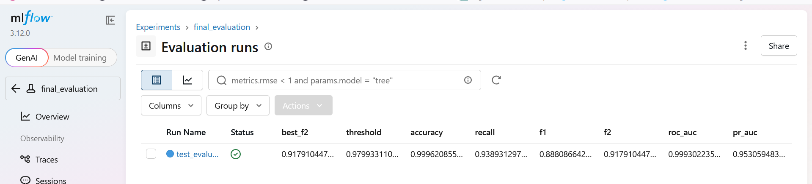
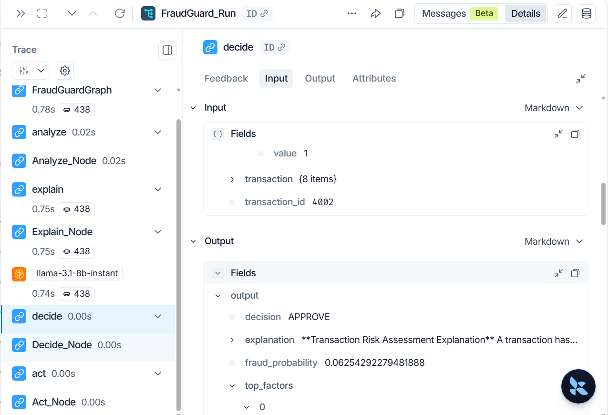

# 🛡️ FraudGuard AI: Agentic Fraud Detection Platform
FraudGuard AI is an industrial-grade, end-to-end ecosystem designed to detect money laundering and financial fraud within the AMLnet dataset.

While traditional ML models act as "black boxes," FraudGuard AI integrates a LangGraph-powered Agent that reasons over SHAP explainability factors. It provides human-readable justifications for every decision, ensuring full regulatory compliance and auditability for banking institutions.
## ⚡ Quick Access (Local Services)
If the system is running via Docker, you can access the full stack here:
Service	URL	Role
* 🖥️ Analyst UI	http://localhost:8501	Streamlit Frontend (Transaction Analysis)

* 🧠 API Gateway	http://localhost:8000/docs	FastAPI Swagger (ML & Agent Endpoints)

* 📈 Experiment UI	http://localhost:5000	MLflow Tracking (35+ Experiments)

* 📊 Monitoring	http://localhost:3000	Grafana Dashboard (Observability)

## 🎯 Core Achievements & Architecture
### 🔬 1. Software Architecture & Model Engineering
Designed and owned the end-to-end software architecture from prototyping to production:
Benchmarking: Evaluated 4 model architectures on a highly imbalanced dataset (0.17% fraud rate).
Optimization: Tuned a champion XGBoost via Optuna (30 trials).
Performance: Achieved 94% Recall, 92% F2-score, and 95% PR-AUC.
Reproducibility: All trials tracked across 35+ MLflow experiments.
### 🤖 2. Agentic AI & Regulatory Traceability
Built a production-grade Agentic AI system using LangGraph to solve the "black box" problem:
Modular API: Exposed via 5 FastAPI/Pydantic endpoints (Predict, Explain, QA, Audit).
Persistence: Every inference (scores, SHAP values, LLM explanations, latency) is persisted to a PostgreSQL audit table.
Compliance: Enabled full regulatory traceability by linking math (SHAP) with reasoning (Llama 3.1).
### 🏗️ 3. Large-Scale Data Pipeline
Engineered a robust pipeline handling 1M+ rows with a focus on efficiency:
Integrity: Batch ingestion with Pandera schema validation.
Optimization: Memory footprint reduced via feature downcasting and Parquet storage.
Rigor: Stratified 3-way train/val/test split to handle extreme class imbalance.
### 🖥️ 4. Interactive Analyst Interface (Streamlit)
Developed a functional user-facing product to bridge the gap between backend and business:
Investigation: Interface for analysts to submit credit applications and visualize fraud risk.
XAI: Real-time rendering of SHAP Waterfall plots and Agentic explanations.
### 🚀 5. Deployment & Full-Stack MLOps
Deployed a scalable microservices architecture with a focus on stability:
Cloud: Deployed on GCP Cloud Run via Docker.
Observability: Established a full stack (Evidently AI, Prometheus, Grafana) monitoring p50: 175ms and p95: 267ms.
Quality: Automated CI/CD via GitHub Actions with an 8-category Pytest suite (100% pass rate).
## 🧪 Model Performance Metrics
Metric	Score	Business Impact
Recall (Fraud)	94.1%	Minimizes regulatory risk by capturing 9.4/10 frauds.
PR-AUC	0.95	High discriminative power on imbalanced AML data.
F2-Score	91.8%	Prioritizes fraud capture over false positives.
p99 Latency	299ms	Real-time response for high-frequency banking.
## 🏗️ System Workflow
code
Mermaid
graph LR
    A[AMLnet Data] --> B[Pandera Validation]
    B --> C[XGBoost Optimization]
    C --> D{LangGraph Agent}
    D --> E[Streamlit UI]
    E --> F[Audit Log SQL]
    F --> G[Grafana Monitoring]
## 📸 Proof of Work 

* 🔬 Agent Reasoning (Streamlit)


The frontend enables real-time interaction with the AI Agent and SHAP explanations.
* 📈 Experiment Tracking (MLflow)

Tracking of 30+ Optuna trials to reach the 95% PR-AUC champion model.

* Langsmith monitoring

* 📊 Monitoring as Code (Grafana)
The monitoring dashboard is fully reproducible. The configuration is stored as Infrastructure as Code in grafana_dashboard.json.
Metrics Tracked: CPU/RAM usage, API Throughput, Error rates, and Inference Latency (p50, p95, p99).
* 🚦 Getting Started
1. Launch with Docker
code
Bash
### Clone the repo
```bash
git clone https://github.com/ngahyves/FraudGuard-AI-Agentic-Fraud-Detection
cd fraud
```
### Start the stack
```bash
docker compose up -d
```
2. Usage Guide (Streamlit)

Open http://localhost:8501.

Enter transaction details in the Sidebar (e.g., Amount: 1,500,000, Type: TRANSFER).
Click "Run Fraud Analysis".
Review the Fraud Probability, the Agent's Reasoning, and the SHAP bar plot.

3. Run Automated Tests
code
Bash
docker compose exec api python -m pytest tests/ -v


👨‍💻 Author
Yves-Ricky – Machine Learning Software Engineer
M.Sc. in Biostatistics | Specializing in Production-Grade ML & Agentic AI.